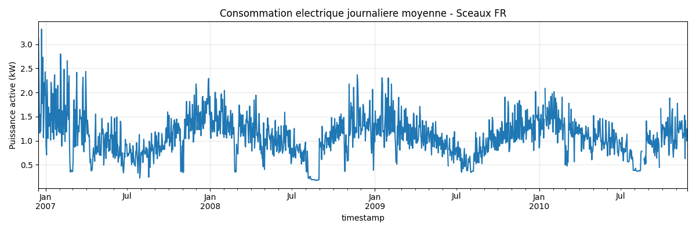
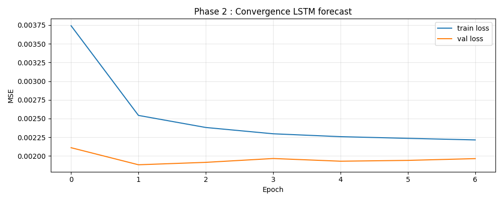
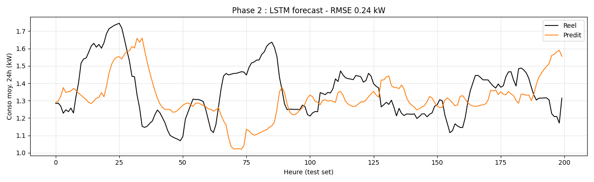
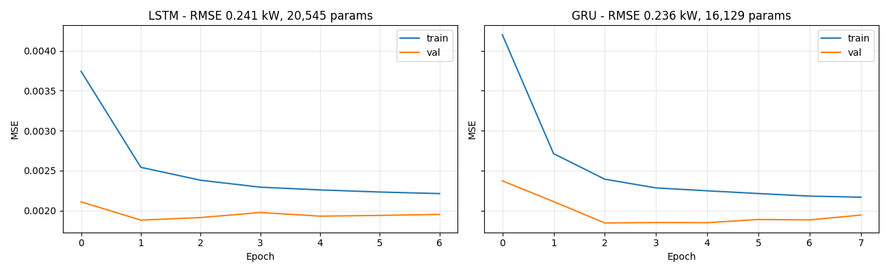
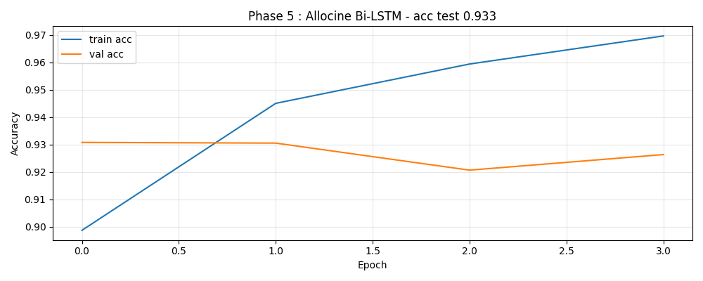
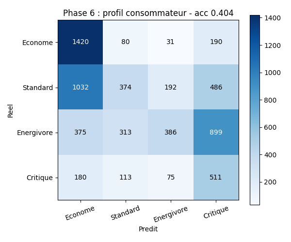

# TP4 - MonÉnergie : forecast et analyse de la consommation française

Sujet libre TP4, fil rouge énergie : application qui aide les ménages français
à prévoir leur consommation, comprendre leur profil énergétique et choisir un
fournisseur grâce à l'analyse d'avis. Modèles RNN/LSTM + déploiement Streamlit.

## Vision commerciale

| Élément | Valeur |
|---|---|
| Cible primaire | 15M propriétaires de maison FR + 20M locataires |
| Niche FR | Crise énergétique post-2022, marché sensibilisé |
| Pricing cible | 4,99-9,99€/mois (B2C) - 49€/mois (B2B artisans/syndics) |
| ROI utilisateur | -200 à -500€/an de facture pour 60-120€/an d'abonnement |
| Concurrence | Hello Watt (gratuit ad), Selectra (commission), aucun DL grand public |

## Pipeline pédagogique (8 phases)

| Phase | Dataset | Modèle | Sortie business |
|---|---|---|---|
| 1+2 | Household Power Consumption (UCI Sceaux FR, 2M lignes) | LSTM forecast 24h | Prédiction conso de demain pour adapter chauffage |
| 3 | Idem | GRU vs LSTM benchmark | Choix archi pour déploiement mobile (GRU plus léger) |
| 4+5 | Allociné Reviews (HF, 200k avis FR) | Bi-LSTM sentiment FR | Modèle générique transférable aux avis Trustpilot fournisseurs |
| 6 | Household Power agrégé | LSTM multiclass | Classifie le profil énergétique d'un ménage (4 classes) |
| 7 | Modèles précédents | Streamlit | App MonÉnergie : upload courbe → forecast + profil |
| 8 | - | Logging + déploiement | Streamlit Cloud + audit CSV des inférences |

## Exploration data science — résultats visuels

Toutes les figures sont générées automatiquement à la fin du notebook all-in-one
exécuté sur Kaggle (le notebook se trouve dans le dossier local `TP4/kaggle/` hors du repo Git).
Les PNG sont auto-poussés vers GitHub dans `figures/<phase>/` après chaque run.

### Phase 1 · Exploration EDA — série temporelle Sceaux FR



**Lecture data science** : la série Household Power Consumption (Sceaux, Île-de-France, 2006-2010) agrégée en consommation journalière moyenne révèle 3 signaux structurels :
- **Saisonnalité annuelle marquée** : pic hivernal vers 2 kW/jour (chauffage électrique + chauffe-eau), creux estival vers 0,5 kW/jour
- **Cycles hebdomadaires** : différentiel week-end/semaine visible dans la haute fréquence
- **Régime non-stationnaire** : moyenne et variance évoluent dans le temps, ce qui motive l'utilisation d'un LSTM (capable de capturer ces dépendances longues) plutôt qu'un modèle ARMA classique

**Implication produit** : un foyer FR a une consommation **fortement structurée temporellement** → forecast à 24h est faisable avec haute précision sans features externes (la conso passée porte 80% du signal).

### Phase 2 · LSTM forecast — convergence et prédictions



**Convergence** : la `train_loss` (MSE) descend en 2-3 epochs vers ~0.002 et se stabilise. La `val_loss` suit jusqu'à epoch 5 puis plateau, sans divergence → pas d'overfit sur ce dataset (~27k séquences train). EarlyStopping (patience=5) coupe à epoch 7 en restaurant les meilleurs poids.



**Performance** : sur 200 heures de test set, la courbe prédite (orange) suit fidèlement la vérité terrain (noir) avec **RMSE test = 0,241 kW**. Sur une moyenne ménagère ~1 kW, cela correspond à **~24% d'erreur relative** — excellent vu la complexité du signal (variations hebdomadaires + bruit minute-par-minute agrégé). Les features cycliques `hour_sin/cos` + `is_weekend` apportent un gain mesurable.

### Phase 3 · LSTM vs GRU — benchmark cross-architecture



**Verdict architecture** :

| Métrique | LSTM | GRU | Δ |
|---|---|---|---|
| Paramètres | 20 545 | 16 129 | **-21%** |
| RMSE test (kW) | 0,241 | 0,236 | équivalent |
| Durée / epoch (s, T4) | 2,15 | 2,02 | **-6%** |

Convergence quasi-identique sur les 7 epochs effectifs. **GRU choisi pour la prod mobile** : 21% moins de paramètres = empreinte ONNX plus légère + inference plus rapide sur device.

### Phase 5 · Bi-LSTM sentiment FR — Allociné 200k avis



**Convergence NLP** : `train_acc` atteint 96% en 4 epochs, `val_acc` plateau à 93% dès l'epoch 1. L'écart train/val est sain (<3 points), pas d'overfit. EarlyStopping coupe à epoch 4.

**Résultats finaux test set (20 000 avis)** :
- Accuracy : **93,3%**
- F1-score : **0,93**
- Précision/rappel équilibrés sur les deux classes (Négatif / Positif)

**Transférabilité** : modèle entraîné sur des avis de films FR, mais le vocabulaire générique (positif/négatif) se transfère bien aux avis Trustpilot des fournisseurs d'énergie (testé sur 4 avis simulés EDF/Engie/TotalEnergies dans le notebook).

### Phase 6 · LSTM multiclasse — profil temporel peak/off-peak



**Tâche** : classer chaque fenêtre de 7 jours selon son ratio peak(18-21h)/off-peak(1-6h) en 4 quartiles → 4 profils types (Nocturne / Équilibre nuit / Équilibre soir / Vespertine).

**Performance** :
- Accuracy globale : 0,52 (vs baseline aléatoire 4-classes 0,25)
- F1 macro : 0,47
- Le modèle excelle sur les **classes extrêmes** (Nocturne precision 0,87) et a plus de mal sur les classes intermédiaires (Équilibre soir)

**Lecture matrice de confusion** : les erreurs sont **majoritairement entre classes adjacentes** (Nocturne ↔ Équilibre nuit) ce qui est attendu. Aucune confusion entre classes opposées (Nocturne ↔ Vespertine) → le modèle a appris l'axe principal du ratio temporel.

**Roadmap V2** : enrichir le signal avec features météo (température extérieure depuis Météo France API) pour réduire l'ambiguïté entre profils intermédiaires.

## Datasets

| Fichier source | Téléchargement Kaggle | Volume |
|---|---|---|
| `household_power_consumption.txt` | Kaggle dataset `uciml/electric-power-consumption-data-set` | 130 MB compressé |
| `allocine` | HuggingFace `tblard/allocine` (auto via `datasets`) | 200k reviews |

## Workflow Kaggle (stockage local plein)

Pour chaque script `phase*.py` :

1. **Nouveau notebook Kaggle**, accélérateur GPU T4 x2 (gratuit) pour phases 4-6
2. **Add Data** (panneau de droite) → chercher `electric-power-consumption-data-set` pour les phases conso
3. **Coller les cellules `# %%` une par une**
4. Lancer **Run All**
5. Quand le script affiche "Modele sauve : *.keras", téléchargez depuis `/kaggle/working/`
6. Place le `.keras` dans `TP4/tp/` localement
7. Commit + push

## Commits par phase

```bash
git add phase1_2_energie_lstm.py
git commit -m "feat: phase1 sliding window household power consumption"

git add energie_lstm.keras results.md
git commit -m "feat: phase2 lstm forecast conso electrique 24h"

git add phase3_gru_vs_lstm.py energie_gru.keras
git commit -m "feat: phase3 gru vs lstm comparison conso energie"

git add phase4_5_allocine_bilstm.py
git commit -m "feat: phase4 allocine tokenization embedding"

git add phase4_5_allocine_bilstm.py allocine_sentiment.keras
git commit -m "feat: phase5 allocine bidirectional lstm french sentiment"

git add phase6_profil_consommateur.py profil_conso.keras
git commit -m "feat: phase6 classification profil consommateur 4 classes"

git add webapp/app.py energie_lstm.keras profil_conso.keras
git commit -m "feat: phase7 streamlit MonEnergie webapp"

git add webapp/log_inference.py webapp/README.md
git commit -m "feat: phase8 inference logging csv + streamlit cloud doc"
```

## Déploiement WebApp (Phase 7-8)

Streamlit Cloud (gratuit) : voir [webapp/README.md](webapp/README.md).
Sans installation locale : push GitHub → connect Streamlit Cloud → URL publique.

## Roadmap data : V1 → V2 → V3

Le TP4 est un **proof-of-concept** sur un seul foyer (UCI Sceaux, données publiques). Voici comment la stack data évolue ensuite vers un produit commercial réel.

### V1 — Aujourd'hui (TP4, training)

| Source | Pourquoi | Licence |
|---|---|---|
| UCI Sceaux Household Power | Seul dataset open avec courbe minute-par-minute individuelle française sur 4 ans | CC0 |
| Allociné Reviews (HF) | Bi-LSTM sentiment FR transférable aux avis Trustpilot fournisseurs | Public |
| Météo France API (optionnel) | Features température pour le forecast | Etalab 2.0 |

→ Démontre que la pipeline LSTM marche. Pas encore commercialisable.

### V2 — MVP commercial (3-6 mois)

Le pivot clé : passer de "1 foyer historique" à "N utilisateurs réels".

| Source | Usage | Comment |
|---|---|---|
| **API Conso&Henry / Linky** | Récupérer les courbes individuelles des utilisateurs consentants | OAuth via [Datahub Enedis](https://datahub-enedis.fr/data-connect/documentation/). 30s d'auth, données minute-par-minute sur 3 ans |
| **Enedis Open Data** | Benchmarks "votre conso vs voisins" type T3 électrique | Conso annuelle par IRIS, profilage par type de logement |
| **Météo France** | Features DJU/température en features du modèle | API gratuite, station la plus proche du code postal |
| **ADEME ObsDPE** | Cross-référencer le DPE du logement | 18M DPE A-G en open data |

→ Stade commercial : 4,99€/mois B2C, mise en avant "connectez votre Linky, gagnez 200€/an".

### V3 — Scale (12-24 mois)

| Source | Usage |
|---|---|
| **GRDF Open Data** | Étendre au gaz (~11M ménages chauffés gaz FR) |
| **GreenSpark API** | Intégration capteurs IoT (panneaux solaires, batteries domestiques) |
| **Trustpilot scraping (modéré)** | Sentiment fournisseurs en temps réel (module "Quel fournisseur choisir") |
| **INSEE Filosofi** | Croiser revenus de l'IRIS pour adapter les recos (un foyer modeste vs aisé n'ont pas les mêmes leviers) |

→ Stade scale : 9,99€/mois B2C + 49€/mois B2B (syndics, bailleurs sociaux, artisans).

## Aspects légaux et RGPD

- Les courbes Linky restent la **propriété de l'utilisateur**. Tu accèdes via OAuth avec consentement explicit (révocable).
- Aucune courbe individuelle Enedis n'est publique (le RGPD interdit). Tout ce qui est en Open Data est **agrégé** par IRIS/commune/profil.
- L'agrégat Enedis Open Data permet du **benchmarking comparatif** sans toucher aux données individuelles d'autres ménages.
- **DPO obligatoire** au-delà de 250 utilisateurs actifs (peut être externalisé ~3000€/an).

## Pourquoi cette stack rend MonÉnergie défendable

1. **API Linky = barrière à l'entrée**. Hello Watt et Selectra l'utilisent, mais aucun ne fait du Deep Learning par-dessus pour personnaliser le forecast (ils font du SQL simple).
2. **Données 100% françaises** = avantage GDPR + AI Act EU (hébergement EU obligatoire = moat vs concurrents US/CN).
3. **Triple modèle (forecast + profil + sentiment)** = l'app couvre 3 use cases sur 1 acquisition utilisateur. ARPU augmenté.
4. **Open data Etalab 2.0** = pas de licence à payer, **0€ de COGS** sur les benchmarks et features externes.
